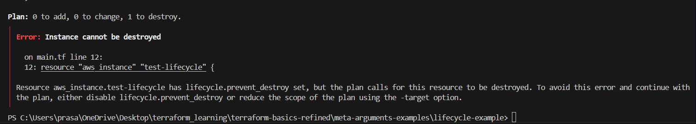

```
The lifecycle block allows us to control specific behaviors of resource management, like preventing certain actions or managing dependencies.
```

create_before_destroy:
By default, when Terraform must change a resource argument that cannot be updated in-place due to remote API limitations, Terraform will instead destroy the existing object and then create a new replacement object with the new configured arguments.

The create_before_destroy meta-argument changes this behavior so that the new replacement object is created first, and the prior object is destroyed after the replacement is created, So downtime is minimized.

prevent_destroy: 
Protects a resource from being accidentally destroyed. This can be useful in many resources. If we attempt to destroy it, Terraform will throw an error.



ignore_changes: 
Ignores specific attributes during updates. This can prevent unnecessary changes if certain attributes don’t need constant updates.
Ignores changes to the tags attribute, so any updates to tags won’t trigger a resource replacement or update.