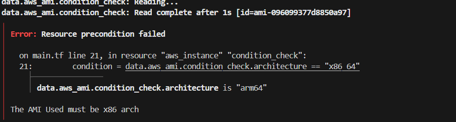

We can use precondition and postcondition blocks to specify assumptions and guarantees about how the resource operates. The following example creates a precondition that checks whether the AMI is properly configured.

Using data source that retrieves information about an AMI to ensure it meets specific criteria before using it in the aws_instance resource.

Using Lifecycle Block with Precondition

condition = data.aws_ami.condition_check.architecture == "x86_64": Verifies that the architecture attribute of the AMI is x86_64. If this condition is not met, Terraform will halt and display an error message I have provided.

