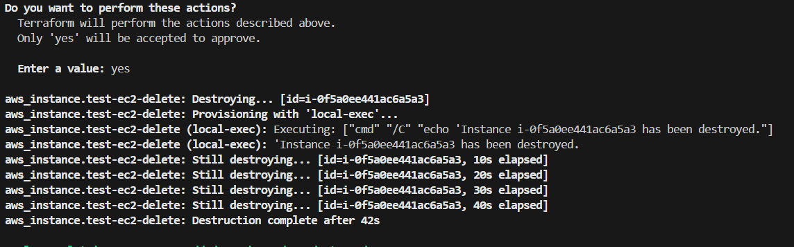

The lifecycle block in Terraform provides additional configuration for how Terraform handles the resource.

A removed block may also contain a Destroy-Time Provisioner, so that the provisioner can remain in the configuration even though the resource block has been removed.

The lifecycle { destroy = true } syntax in our original code is invalid in Terraform. If we want to control resource destruction, we can use prevent_destroy.

The provisioner "local-exec" block with when = destroy will work only when we intentionally destroy the resource with terraform destroy or modify it in a way that triggers a destroy action.

