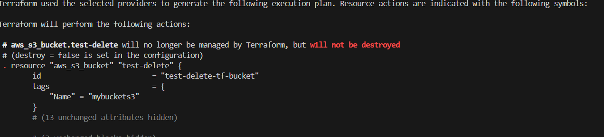

The lifecycle block in Terraform provides additional configuration for how Terraform handles the resource.

If we wish to remove a resource from our Terraform configuration without destroying the real infrastructure object it manages. In this case, the resource will be removed from the Terraform state, but the real infrastructure object will not be destroyed.

So We need to remove the resource block from our configuration and replace it with a removed block:

The from argument is the address of the resource we want to remove, without any instance keys (such as "aws_instance.remove-instance1").

The lifecycle block is required. The destroy argument determines whether Terraform will attempt to destroy the object managed by the resource or not. A value of false means that Terraform will remove the resource from state without destroying it.

